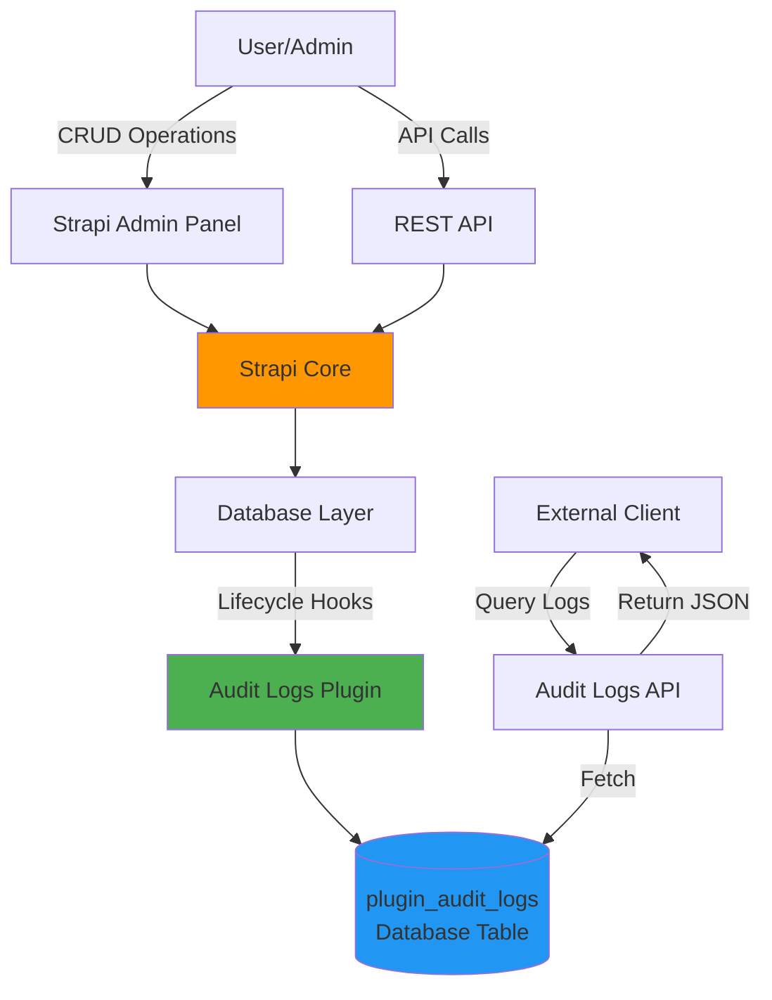
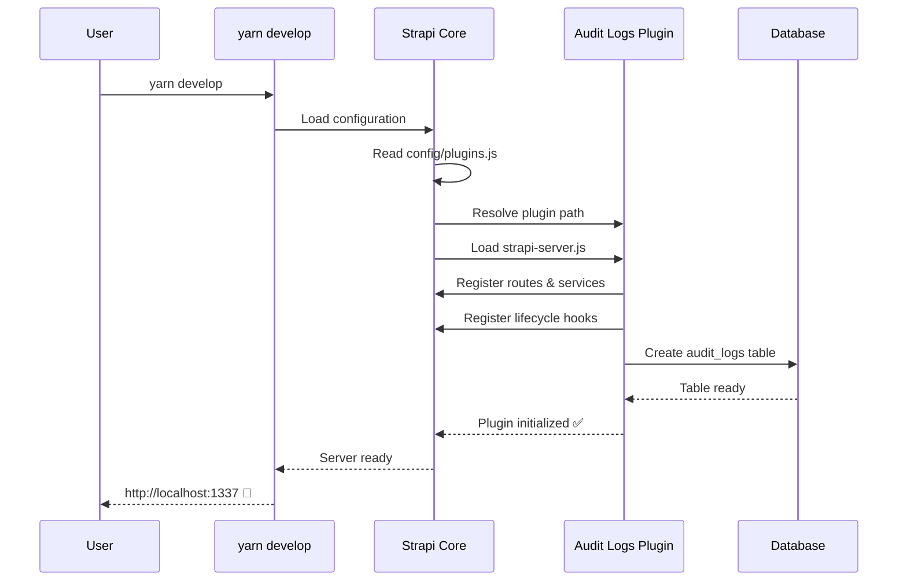
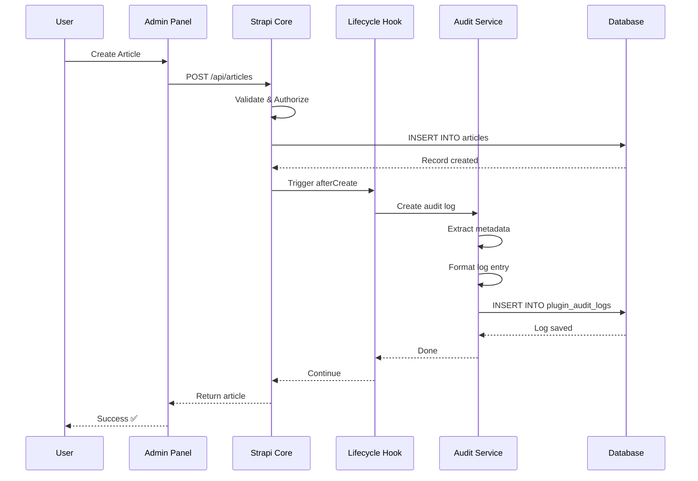
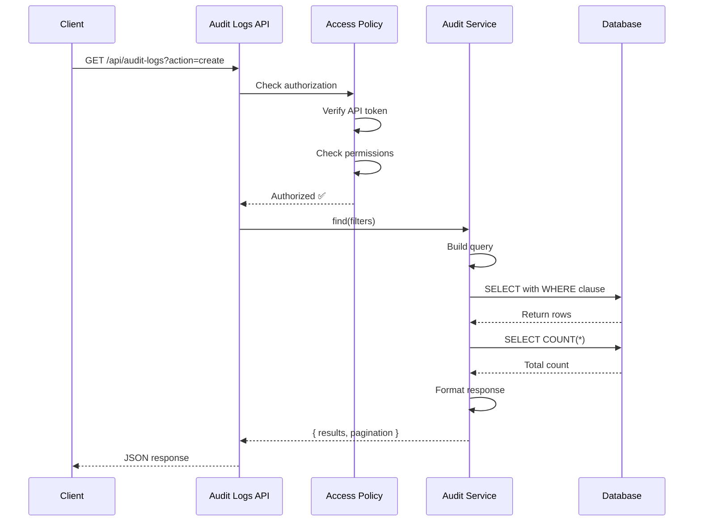
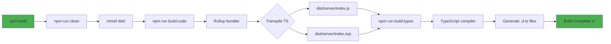
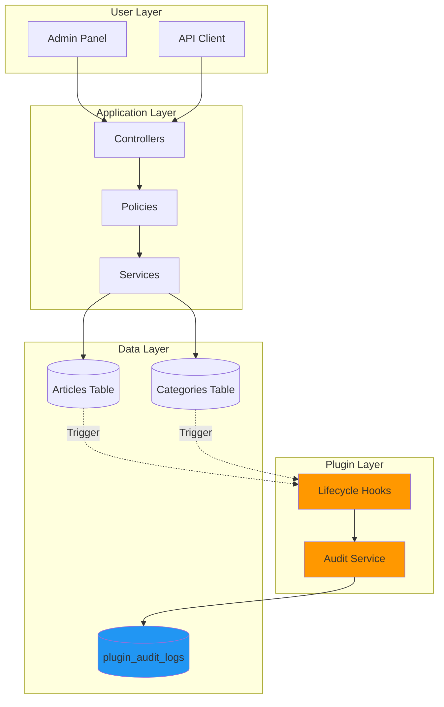
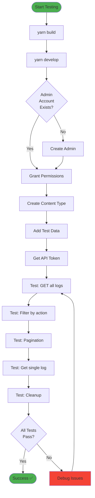
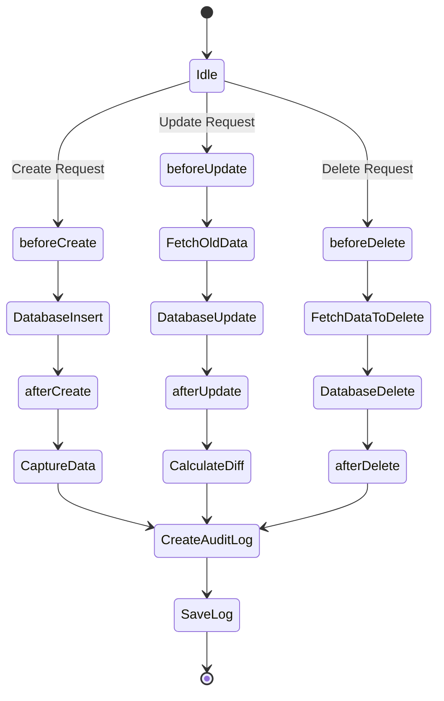
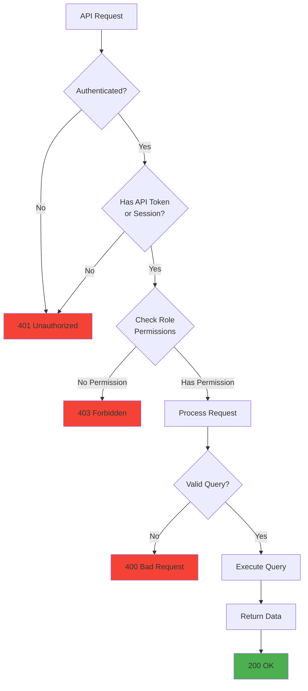
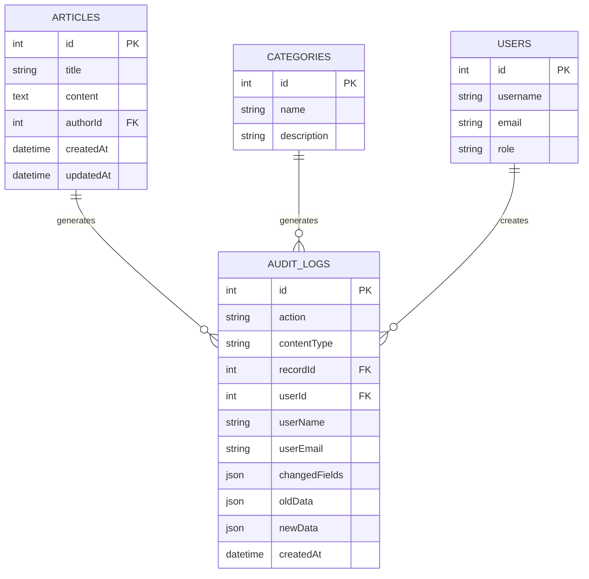

# 🎨 Visual Flow Diagrams (Mermaid)

Copy and paste these into any Mermaid renderer (GitHub, Mermaid Live Editor, etc.)

## 1. High-Level System Architecture

## 2. Plugin Initialization Sequence

## 3. CRUD Operation with Audit Logging

## 4. API Query Flow

## 5. Build Process Flow

## 6. Data Flow Architecture

## 7. Complete Testing Workflow

## 8. Lifecycle Hook Execution

## 9. Permission Check Flow

## 10. Database Schema Relationships

---

## How to View These Diagrams

### Option 1: GitHub (Automatic)
Just push this file to GitHub - it renders Mermaid automatically!

### Option 2: Mermaid Live Editor
1. Go to: https://mermaid.live/
2. Copy any diagram code above
3. Paste and see it rendered

### Option 3: VS Code Extension
1. Install "Markdown Preview Mermaid Support" extension
2. Open this file in VS Code
3. Press `Ctrl+Shift+V` to preview

### Option 4: Online Markdown Editors
- https://stackedit.io/
- https://dillinger.io/
- Both support Mermaid diagrams!